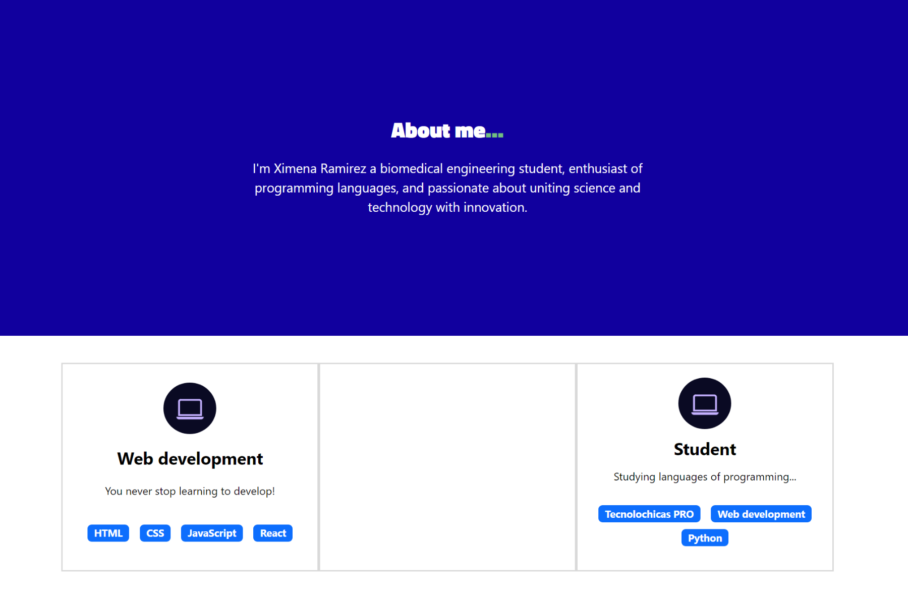
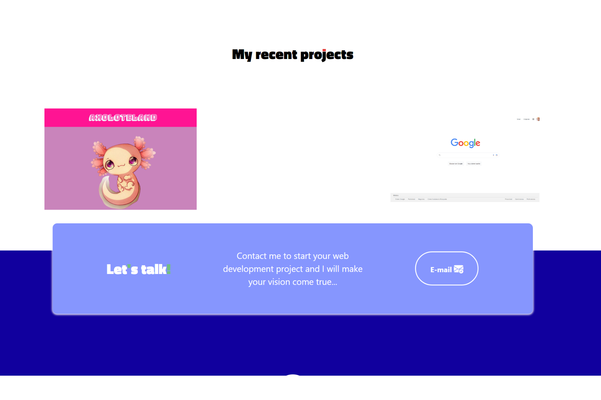
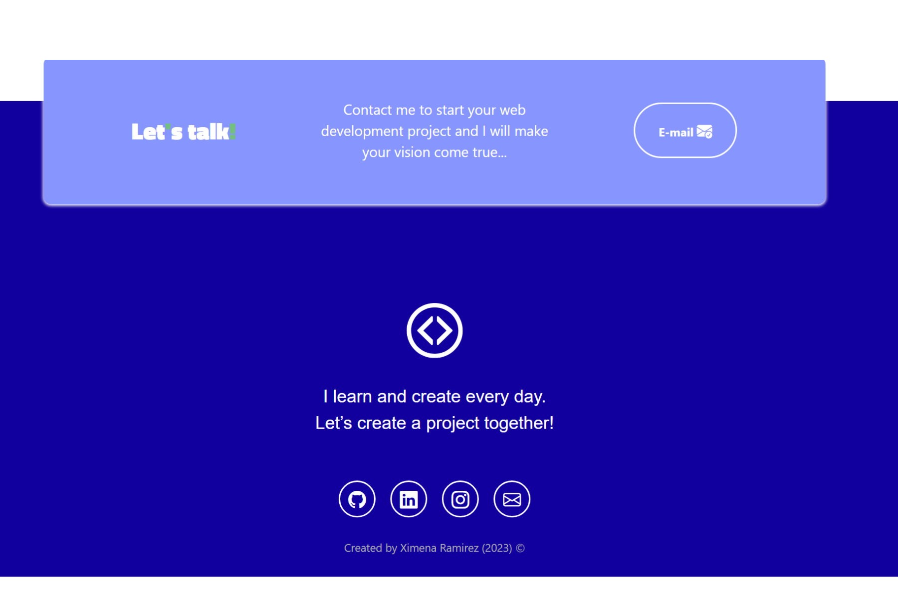

# Invitación a salida de cumpleaños.

Este proyecto creado para una invitación a celebrar un cumpleaños, es una página web adaptable a dispositivos de distintos tamaños (este tipo de sitio web se conoce en inglés como "responsive"). 

El propósito de esta página web es mostrar el itinerario del día, lugares, nombres, código de vestimenta.cIncluye una descripción breve acerca de las personas y formas de contacto. 

También incluye imágenes alternativas en la carpeta `imagenes` en caso de que se desee personalizar la imagen principal del desarrollador, además de animación a la escritura de la página web con JavaScript.

### Capturas de pantalla:

Primera parte de la página web:

Experiencia:

Proyectos:

Contacto:

## Tecnologías

Esta página web fue creada con:

* HTML
* CSS
* JavaScript 
* Bootstrap 5

Además, se incluyeron **Google Fonts** para personalizar la fuente y **Bootstrap icons** para incorporar íconos como flechas y logos de redes sociales populares. 

## Español

El texto de la página web está escrito en españpl, las clases y atributos personalizados están en español. Las clases relacionadas con Bootstrap se incluyeron en inglés.

Link del demo:
https://quinto-de-siglo-ax.netlify.app/

